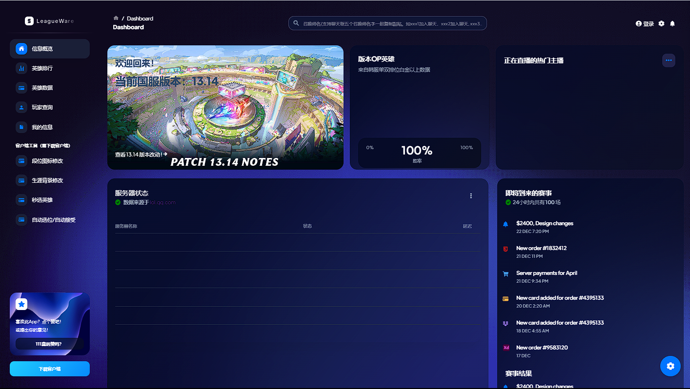

# LW-electron
> ### :loudspeaker:基于electron + react构建的桌面端英雄联盟助手。旨在最大化玩家对客户端的自定义程度
> ps: 刚接触js，react和electron完全没用过。UI方面找了个开源的数据可视化项目做二次开发。语法方面完全照着java和python的思路边摸索边写，就当前端练手项目了。项目结构暂时有点乱。主打能跑就行。先画个大饼：等基础功能实现了之后调整下项目结构。大佬轻喷
* 客户端缩略图 

### 预实现的功能

#### 1. 
